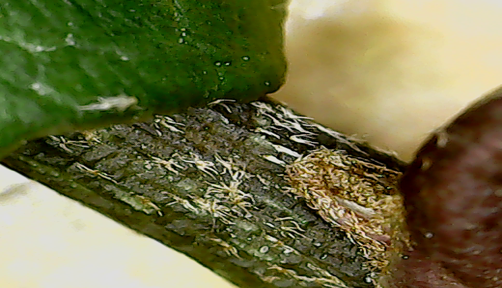

# Hedera Genus

1. Tricomas de las **hojas jóvenes y brotes estériles** con 4-9(13) radios, multidireccionales o rotados, soldados en un 3-20(40)% de su longitud, de color blanquecino 2
*...maderensis*
2. Tricomas generalmente estipitados, de (0,2)0,6-0,9(1,2) mm de diámetro, con 4-8(9) radios, multidireccionales, soldados en un 3-10(40)% de su longitud ......... 1. H. helix

    3. **Hojas de las ramas estériles** de (0,5)3,8-6,4(10,6) × (0,5)3,7-6,4(9,8) cm, con (0)3-5(7) lóbulos, nervios poco prominentes, en general sin ceras blanco-grisáceas; **ramas jóvenes estériles rectas**  a. subsp. helix
     Foz de Zafrané, 19/02/26
    4. Hojas de las ramas estériles de (0,5)1,6-2,9(4,3) × (0,5)1,9-2,8(3,7) cm, con (0)3 ló bulos, nervios prominentes, cubiertos de ceras blanco-grisáceas; **ramas jóvenes estériles serpenteantes** b. subsp. rhizomatifera

(Viene de 2.)
– Tricomas generalmente sésiles, de (0,1)0,4-0,6(0,9) mm de diámetro, con (5)7-9(13) radios, rotados, soldados en un 10-20(40)% de su longitud 2. H. hibernica
